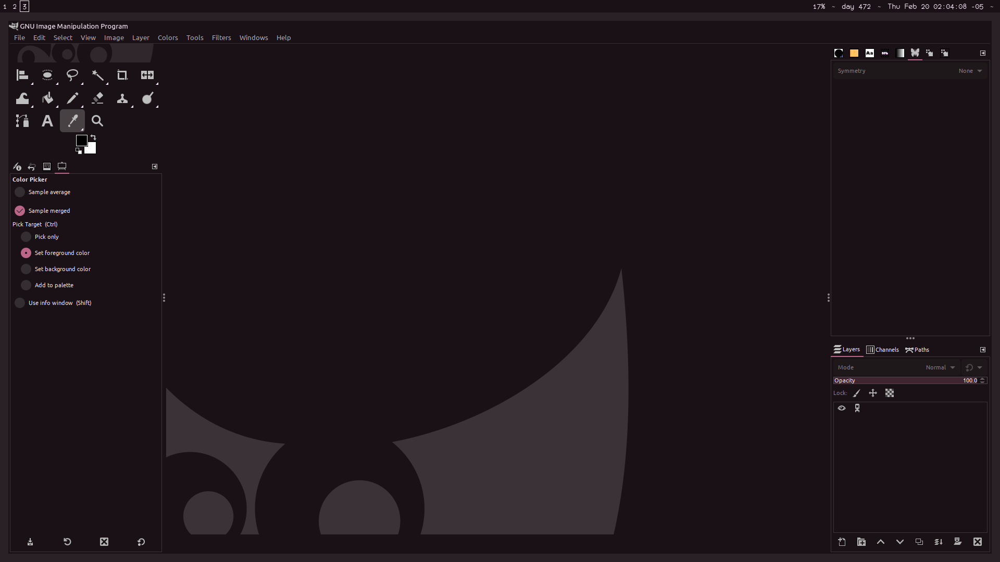
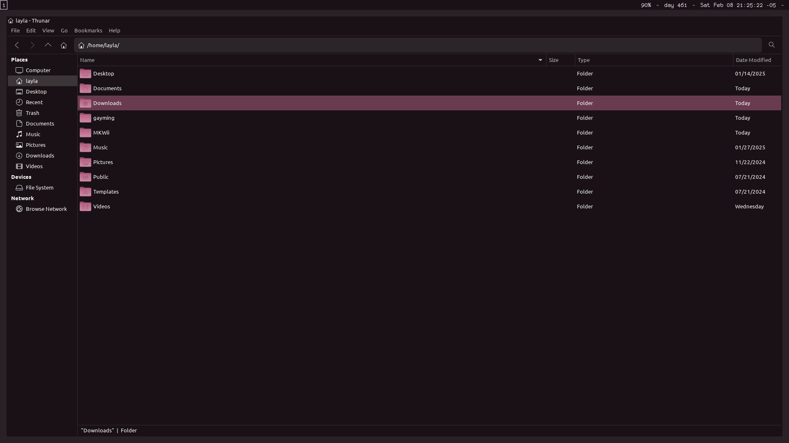
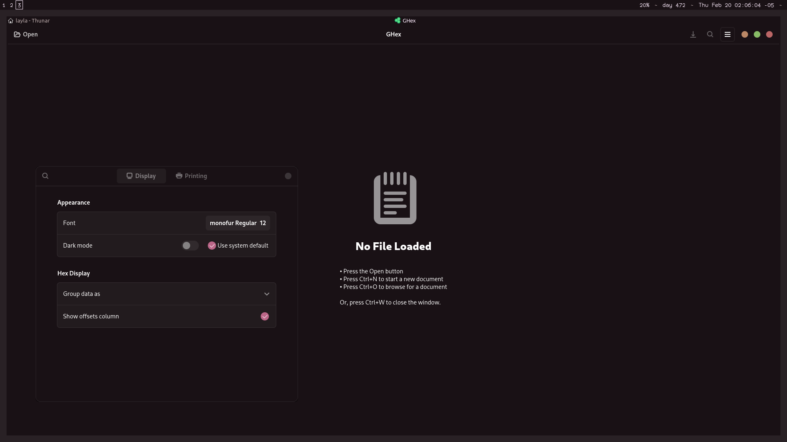
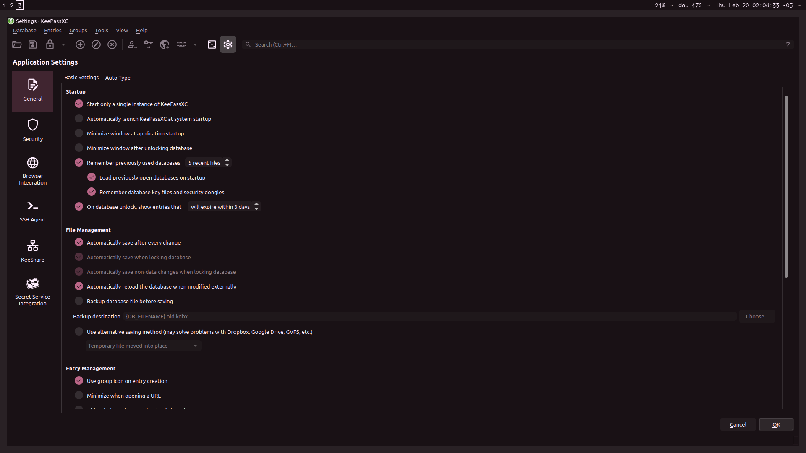
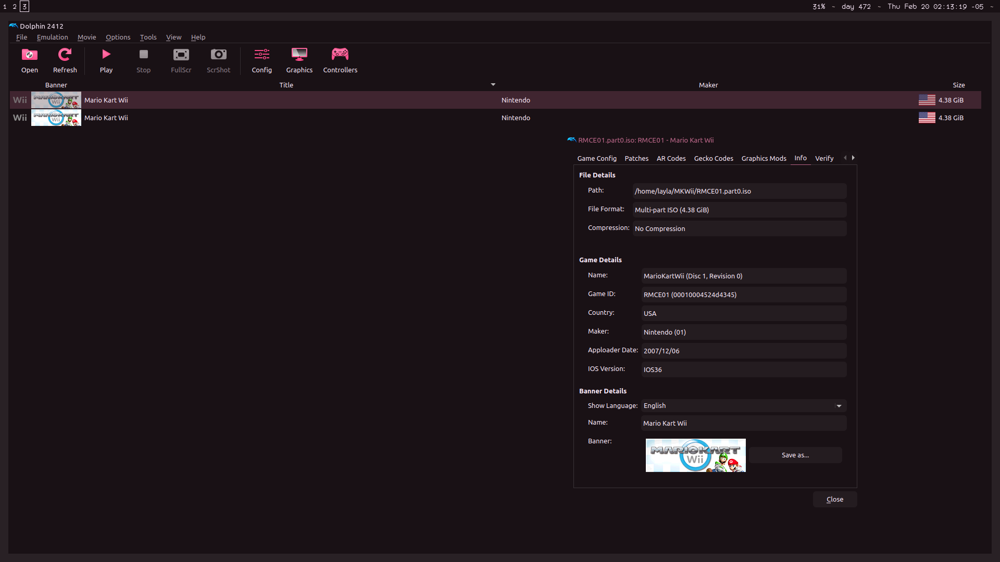

# Colloid-layla gtk theme

this is a fork of [Colloid-gtk-theme](https://github.com/vinceliuice/Colloid-gtk-theme) which replaces the default color scheme with [my own color scheme](https://github.com/MelodicCatgirl/layla-color-scheme)

## Requirements

- GTK `>=3.20`
- `gnome-themes-extra` (or `gnome-themes-standard`)
- Murrine engine — The package name depends on the distro.
  - `gtk-engine-murrine` on Arch Linux
  - `gtk-murrine-engine` on Fedora
  - `gtk2-engine-murrine` on openSUSE
  - `gtk2-engines-murrine` on Debian, Ubuntu, etc.
- `sassc` — build dependency

- `Icon theme` [Colloid-layla](https://github.com/MelodicCatgirl/Colloid-layla-icon-theme)

## Installation

### Manual Installation

please note that the light mode is not really supported with this fork, and also i haven't actually tested any of the color variants

Run the following commands in the terminal:

```sh
./install.sh
```

> Tip: `./install.sh` allows the following options:

```
-d, --dest DIR          Specify destination directory (Default: ~/.themes)
-n, --name NAME         Specify theme name (Default: Colloid-layla)
-t, --theme VARIANT...  Specify theme color variant(s) [default|purple|pink|red|orange|yellow|green|teal|grey|all] (Default: blue)
-c, --color VARIANT...  Specify color variant(s) [standard|light|dark] (Default: All variants)
-s, --size VARIANT...   Specify size variant [standard|compact] (Default: standard variant)

-l, --libadwaita        Install specify gtk-4.0 theme into config folder ($HOME/.config/gtk-4.0) for all gtk4 apps use this theme
                        Default ColorSchemes theme will follow the system style (light/dark mode switch), all ColorSchemes versions not support this !
                        Options for default ColorSchemes:
                        1. system                      Default option (using system colors for light/dark mode switching)
                        2. fixed                       Using fixed theme colors (that will break light/dark mode switch)

--tweaks                Specify versions for tweaks
                        1. [nord|dracula|gruvbox|everforest|catppuccin|all]  (Nord/Dracula/Gruvbox/Everforet/Catppuccin/all) ColorSchemes version
                        2. black                       Blackness color version
                        3. rimless                     Remove the 1px border about windows and menus
                        4. normal                      Normal windows button style like gnome default theme (titlebuttons: max/min/close)
                        5. float                       Floating gnome-shell panel style

-r, --remove,
-u, --uninstall         Uninstall/Remove installed themes or links

-h, --help              Show help
```

> For more information, run: `./install.sh --help`

### Fix for Libadwaita

```sh
./install.sh -l
```

Default ColorSchemes themes will follow the system style now ! (switch [light/dark] mode)

### Fix for Flatpak

```sh
sudo flatpak override --filesystem=xdg-config/gtk-3.0 && sudo flatpak override --filesystem=xdg-config/gtk-4.0
```

If you use flatpak apps, you can run this to fix theme issue

### Flatpak Installation (gtk-3.0)

Automatically install your host GTK+ theme as a Flatpak. Use this:

- [pakitheme](https://github.com/refi64/pakitheme)

### rounded corners fix

i have an issue with the Colloid gtk theme where it is seemingly supposed to have rounded corners on some of the popup menus, but it has a black background behind it instead of transparency. if you are also having this issue, you can just fix it by using picom rounded corners (my picom.conf file is in this repository if you want to steal it).

## screenshots

**GIMP** (gtk2)


**Thunar** (gtk3)


**GHex** (libadwaita)


**KeePassXC** (qt5 w/ qt5-styleplugins)


**Dolphin Emulator** (qt6 w/ qt6gtk2)

